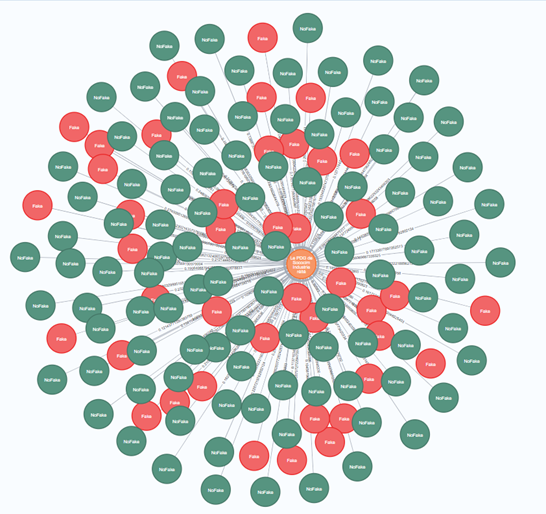
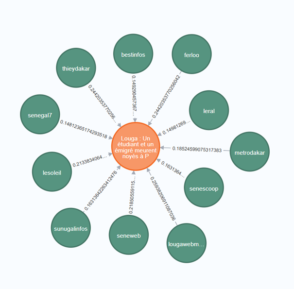

# Conception d'un modèle de Clustering pour la détection de Fausses Informations

## 📝 Description du Projet

Face à la prolifération des "Fake News" au Sénégal, ce projet propose une approche de détection basée sur l'apprentissage non supervisé. L'objectif est de grouper les articles de presse en sujets cohérents et d'analyser leur susceptibilité à contenir de la désinformation.

La solution s'appuie sur des outils de Traitement Automatique du Langage Naturel (NLP) et des Grands Modèles de Langage (LLMs), notamment :
* **BERTopic & LDA** : Pour la modélisation et le clustering des sujets.
* **BertSum** : Pour la génération de résumés automatiques.
* **Analyse de similarité** : Pour classifier les articles et détecter les potentiels contenus fallacieux.

Pour plus de détails théoriques et méthodologiques, vous pouvez consulter le fichier `memoire_Steve SANOGO.pdf` inclus dans ce dépôt.

<figure> 
   
   <figcaption>Pipeline</figcaption>
</figure> 

## 📂 Structure du Dépôt

Le projet est organisé comme suit :

### 1. `notebooks/`
Ce répertoire contient les scripts Jupyter implémentant le pipeline de traitement :

* **`01_data preprocessing.ipynb`** : 
    * Script dédié au nettoyage et à la normalisation des données brutes.
    * Implémente les techniques décrites dans la section *5.2. Prétraitement des données* du mémoire (nettoyage de texte, gestion des doublons, formatage).
* **`02_topic modeling BertTopic-LDA.ipynb`** : 
    * Entraînement des modèles de topic modeling (BERTopic).
    * Connexion à la base de données MongoDB (`articlesdb`).
    * Génération des clusters de sujets.
* **`03_text summarization BertSUM.ipynb`** : 
    * Utilisation de modèles Transformers (BertSum) pour générer des résumés concis des sujets identifiés.

### 2. `data/`
Ce répertoire contient les jeux de données utilisés et générés par le projet :

* **`baseArticles.json`** : Données brutes issues du Web Scraping, sans aucun traitement préalable.
* **`processed_baseArticles.json`** : Version nettoyée et prétraitée des articles, prête pour l'ingestion par les modèles.
* **`topicsdb.json`** : Base de données finale structurée par sujets. Pour chaque sujet, elle contient :
    * La liste des articles associés.
    * Le résumé du sujet.
    * Les mesures de similarité (article vs résumé).
    * Les labels de classification (Fake / NoFake).

### 3. `memoire_Steve SANOGO.pdf`
Le document complet du mémoire, fournissant le contexte théorique, l'état de l'art et l'analyse détaillée des résultats.

## 🚀 Installation et Prérequis

Pour exécuter les notebooks, vous aurez besoin d'un environnement Python (recommandé : Python 3.8+ ou Google Colab) avec les bibliothèques suivantes :

```txt
numpy
pandas
pymongo
spacy
bertopic
transformers
torch
scikit-learn
dateparser

```

## ⚙️ Utilisation

L'exécution du projet suit une séquence logique :

1. **Prétraitement** : Lancez `01_data preprocessing.ipynb` pour nettoyer `baseArticles.json` et générer `processed_baseArticles.json`.
2. **Modélisation** : Lancez `02_topic modeling BertTopic-LDA.ipynb` pour créer les clusters de sujets à partir des données nettoyées.
3. **Résumé & Analyse** : Lancez `03_text summarization BertSUM.ipynb` pour générer les résumés et finaliser la base `topicsdb.json`.

## 🖼️ Quelques résultats

<figure> 
   
   <figcaption>Clusters d'articles de la BD</figcaption>
</figure> 


<figure> 
   
   <figcaption>Représentation graphique du sujet 1</figcaption>
</figure>

<figure> 
   
   <figcaption>Représentation graphique du sujet 111</figcaption>
</figure>

---

*Ce projet a été réalisé dans un cadre académique à l'ESMT Dakar - Promotion 2020-2023.*
